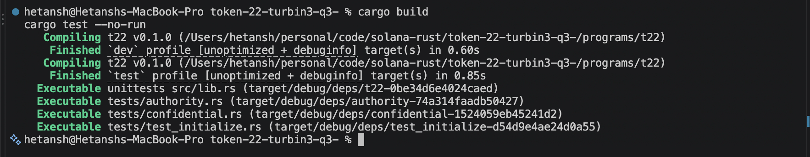

# Token-2022 Remittance Stablecoin

Anchor/Solana Token-2022 exercise implementing a remittance stablecoin mint with:

- transfer fees for issuer revenue
- metadata pointer on the mint
- frozen-by-default accounts for KYC
- mint close authority
- fee-aware transfers using `transfer_checked_with_fee`
- KYC thaw path for individual accounts
- re-issued confidential/seizable mint with `PermanentDelegate`
- confidential transfer lifecycle examples

## Verification

These local checks pass:

```bash
cargo build
cargo test --no-run
```



Full runtime tests require the SBF artifact:

```bash
cargo build-sbf && cargo test
```

On this machine, `cargo build-sbf` is blocked by Solana platform-tools Cargo `1.84.0`, which cannot parse newer `edition2024` dependency manifests. The code and tests compile successfully with the commands above.
