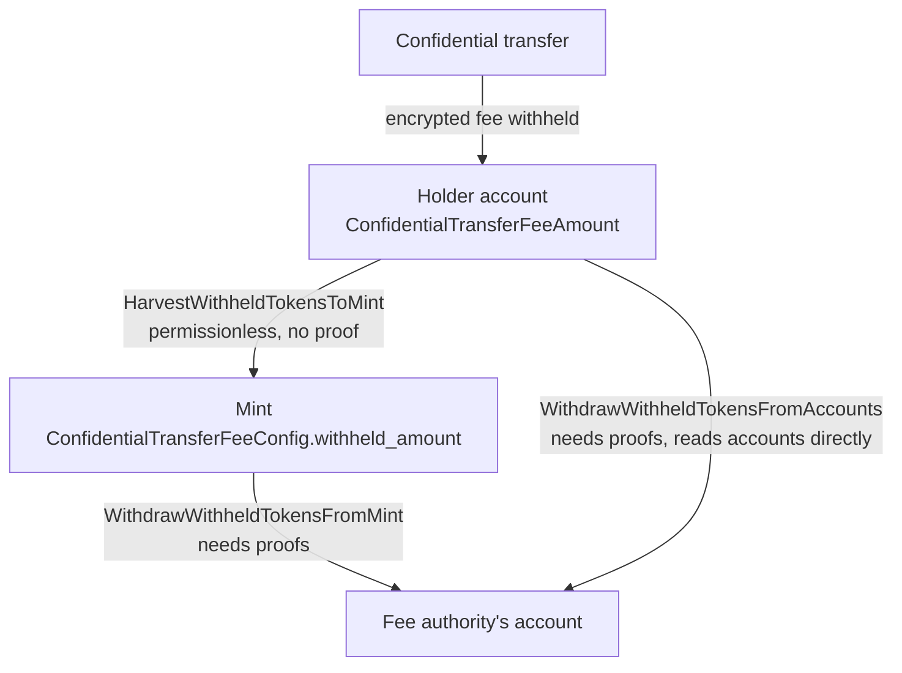
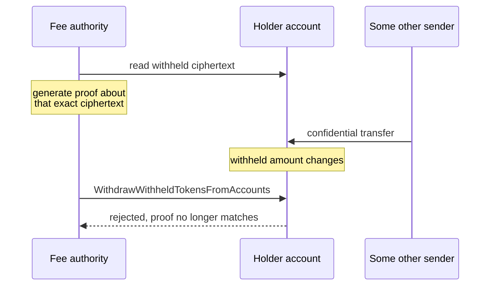
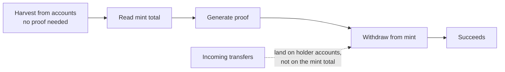

# Why harvest before you withdraw

A design confidential transfer fees (I didn't have the time to put this in a slide but you get the message lol)

## The two routes

Once a mint carries `ConfidentialTransferFeeConfig`, every confidential
transfer withholds an encrypted fee on the **recipient's** account. Those fees
sit there until the withdraw-withheld authority collects them, and there are
two ways to do that.

The lower path looks more efficient. One instruction instead of two, no
intermediate step. It is also the one that breaks under load.

## The race

Withdrawing requires a zero-knowledge proof, and that proof is generated
**off-chain, against a specific ciphertext**. The authority reads an account's
withheld balance, builds a proof about that exact value, then submits it.

Between those two moments the account is still live. Anyone can send it another
confidential transfer, which withholds another encrypted fee and changes the
ciphertext the proof was built against.

Nothing is broken and nothing is stolen. The withdraw simply fails, and the
authority regenerates the proof and tries again. On a quiet mint that is a
non-event. On a busy one the authority can lose the race repeatedly, and the
busiest accounts are exactly the ones holding the most fees.

Note also that generating those proofs is not free. Each failed attempt is
wasted client-side work plus a wasted transaction.

## Why harvesting fixes it

`HarvestWithheldTokensToMint` is permissionless and needs no proof. It moves the
encrypted withheld amount from an account into the mint's running total,
homomorphically. Anyone can call it, including the authority, a keeper, or the
holders themselves.

Once the fees are at the mint, the authority withdraws from **the mint**, not
from accounts. The mint's `withheld_amount` only changes when someone harvests,
and harvesting is something the authority can do immediately before it builds
its proof. Incoming transfers keep landing on holder accounts and no longer
touch the value the proof was built against.

The race does not disappear so much as move somewhere harmless: the worst case
is that a harvest lands between the read and the withdraw, and the authority
collects slightly less than it could have. Nothing fails.

## The general shape

This is worth naming, because it is not specific to transfer fees.

**Any operation that generates a proof off-chain against mutable on-chain state
is racing whoever can mutate that state.** The fix is not a better proof, it is
choosing a target that the adversary, or simply ordinary traffic, cannot move
between generation and submission.

The same reasoning sorts of explains the pending and available balance split. Incoming
transfers land in *pending*, so they cannot disturb the *available* balance that
a transfer proof was built against. Withdrawing from the mint rather than from
accounts is the same idea applied to fees.

## Practical guidance

- Default to harvest-then-withdraw. Treat direct withdrawal from accounts as an
  optimisation for accounts you know are idle.
- Harvest in batches, immediately before withdrawing. The instruction accepts
  many accounts at once and needs no proof.
- Remember the mint authority can disable harvesting entirely with
  `DisableHarvestToMint`. If it is off, the direct path is the only path, and
  the race is unavoidable.
- The withheld amount is encrypted under the fee authority's ElGamal key, not
  the holder's. Holders cannot read what has been withheld from them, and the
  authority can read it on every account.